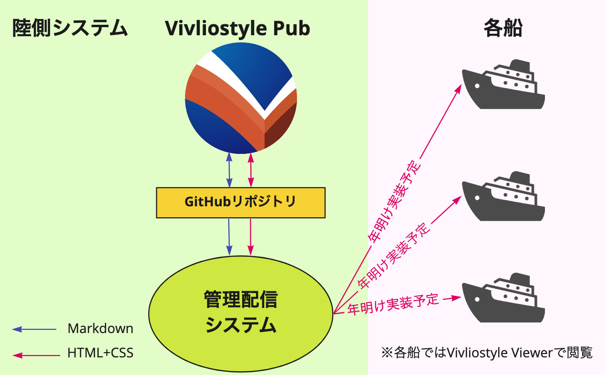
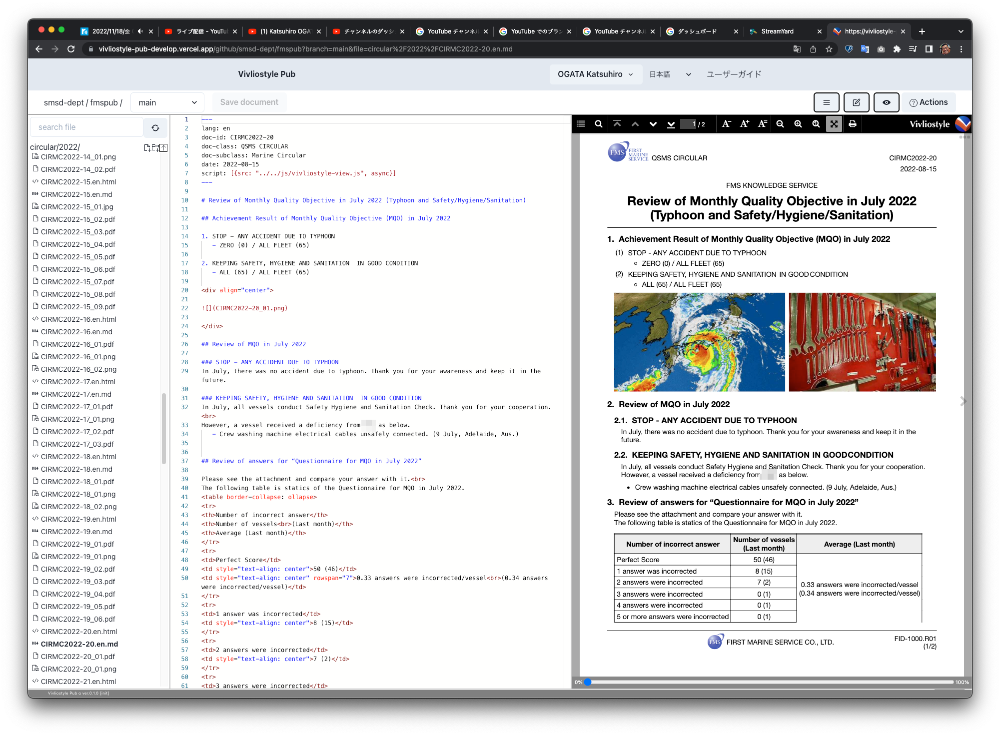
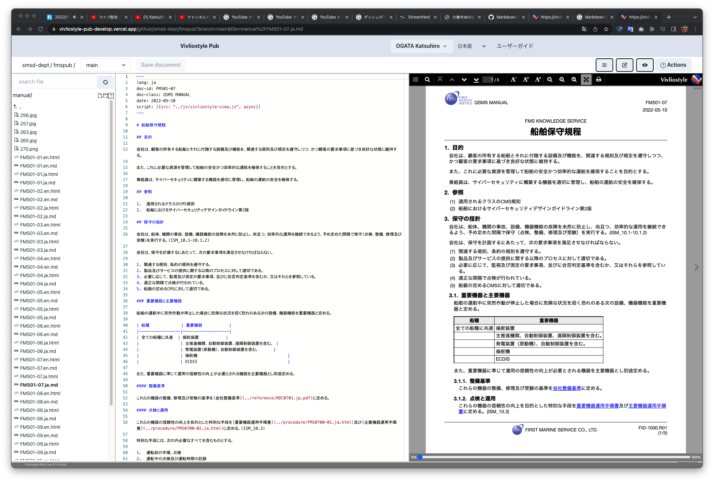
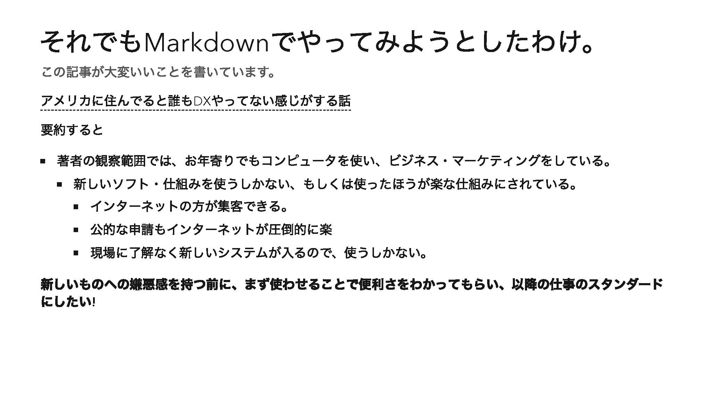

# Vivliostyle もう一つのブルーオーシャン{.cover}

## 小形克宏

### 2022年11月20日 Vivliostyle ユーザーと開発者の集い2022秋

# 本日お伝えしたいこと{#agenda}

- Vivliostyle.jsはライブラリです
- つまりVivliostyle.jsから、新たなアプリが作れます
- Vivliostyleは思われている以上の、たくさんの未来があります
- あなたがそれを作りさえすれば。

# Vivliostyleといえば 印刷用PDF作成{#preconception}

- 技術書典が近づくとVivliostyle CLIのダウンロードが急増
- Vivliostyleにとって印刷用PDF作成はブルーオーシャン
- しかし、Vivliostyleの用途はそれだけ？

# 社内文書の共同編集の事例{#tommy-1}

- 9月に話題になったQiitaの記事 
- [納品ドキュメントの作成にMarkdown+Vivliostyleを採用した話](https://qiita.com/tommyecguitar/items/2d1817cc8a09c15ad43e)
    - 社内文書の共同編集／閲覧にVivliostyleを利用
    - 以下、ざっとその趣旨を紹介→

# WordとMarkdownの比較{#tommy-2}

- **Wordの困ったところ**
    - 共同編集すると、編集したところが消える
    - フォントやデザインがなぜか統一されない
    - セクションごとに担当を分けても、マージが手作業
- **Markdownを使うとよいが、デメリットも**
    - 執筆とデザインを分離できる
    - マージするのにGitHub（ブランチ）を使える
    - その一方で図版キャプション等、記法に限界がある

# そこでVivliostyleを使ったら{#tommy-3}

- **Vivliostyleのメリット・デメリット**
    - （Markdownのメリットに加えて）
    - VFMなら図版キャプションが使える
    - SCSSでスタイル指定できる
    - ページごとにスタイルを変えられる
    - PDF出力が簡単
    - しかし、表にキャプションが入れられない
- **10月開発者会議で作者のとみー氏がさらなる詳細を報告**
    - →[製造業でドキュメントをVivliostyleで運用した話](https://vivliostyle.slack.com/archives/CAECW4S93/p1664603649765059)
    - VivliostyleのSlackで公開中

# まとめ{#tommy-4}

- **Vivliostyleの良いところ**
    - {冪等性|べきとうせい}：編集してもスタイルが変わらない
    - Gitを使ってバージョン管理ができる
    - 共同編集がしやすい
    - その上、PDFにも出力可能
- これらのメリットは、印刷用PDF作成でも同じ
- **つまり、上記メリットが生きる用途ならVivliostyleは使えるはず**

# [ファーストマリンサービス(株)](https://fmarine.co.jp/){#fms-1}

- 同社は国際輸送の船舶管理会社（非エンジニア・ユーザ）
- 海外運行中の船舶向け書類をVivliostyle Pubで共同編集
- 今年1月以来、現在まで300本以上の文書を作成

# Vivliostyle Pub + GitHub

{width=76%}

# 実際の文書を紹介①{#fms-2}

{width=63%}

# 実際の文書を紹介②{#fms-3}

{width=69%}

# まとめ{#fms-4}

- 前述Vivliostyleのメリットはエンジニアだけのものではない
    - 非エンジニアでもGitを使ってバージョン管理ができる
    - 非エンジニアでもブランチを使って共同編集できる
    - つまり、共同編集はもう一つのブルーオーシャン

# とみー氏のスライドから引用{#fms-5}

{width=83%}

# ほかには？

- [vivliostyle/vivliostyle-sitegen（開発中）](https://github.com/vivliostyle/vivliostyle-sitegen)
    - Vivliostyleのサイトの制作用CMSとしてスタート
    - 別の言い方をすると、VFMを使えるCMS
    - 共同編集でサイト制作ができる
    - 書籍作成からサイト制作に、用途を広げる新規プロダクト
    - ただし、メンテナーakabeko氏が多忙で開発中断
    - 誰か、開発に参加できる方はいませんか⁉︎
