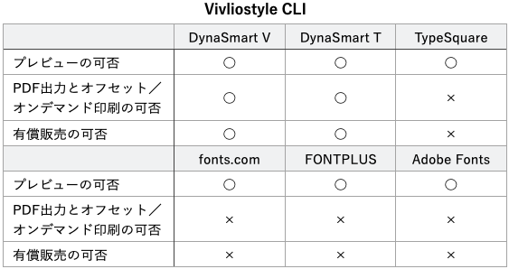
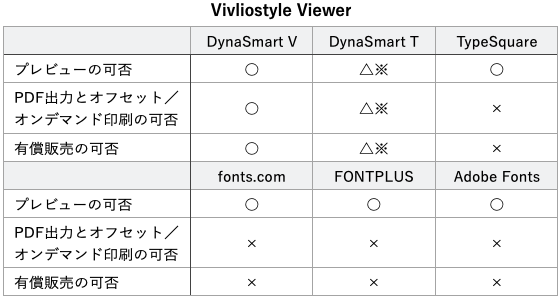
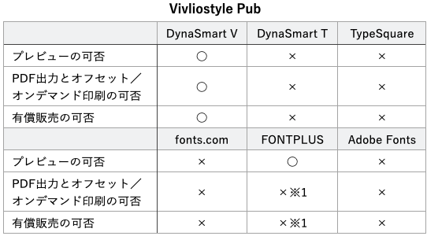
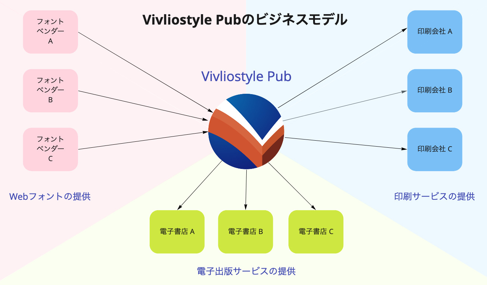

# Vivliostyleで Webフォントを使う：調査編 {.cover}

## 小形克宏

### 2022年4月23日 Vivliostyle ユーザーと開発者の集い2022春

# ToC {.toc hidden}

1. [Webフォントサービスとフォントファウンダリー①](#webfontservices-and-fontfoundries-1)
2. [Webフォントサービスとフォントファウンダリー②](#webfontservices-and-fontfoundries-2)
4. [Webフォントを読み込む方法](#how-to-load-Webfonts)
5. [Webフォントサービスごとの読み込み方法](#how-to-load-each-webfont-service)
6. [利用規約からみたWebフォントサービスの3類型](#terms-of-use-for-webfont-service)
7. [ⓐ「利用者のWebサイト以外での使用を禁止」方式](#prohibition-of-use-other-than-the-users-website)
8. [ⓑ利用者がデザイン、開発、作成するWebサイト以外を禁止方式](#prohibits-websites-other-than-those-designed-developed-or-created-by-the-user)
10. [ⓒ「印刷物／Webサイトデザイン／電子書籍を許諾」方式](#printing-website-design-and-ebooks-are-permitted)
10. [Vivliostyleで利用できるWebフォントサービス](#web-font-services-available-in-vivliostyle)
11. [Vivliostyleプロダクトの2類型](#two-types-of-vivliostyle-products)
12. [置かれた場所ごとのWebフォント利用可否①](#web-font-availability-by-location-1)
13. [置かれた場所ごとのWebフォント利用可否②](#web-font-availability-by-location-2)
15. [プロダクトごとの利用可否①](#availability-by-product-1)
16. [プロダクトごとの利用可否②](#availability-by-product-2)
16. [プロダクトごとの利用可否③](#availability-by-product-3)
21. [まとめ](#summary)

# Webフォントサービスと フォントファウンダリー①{#webfontservices-and-fontfoundries-1}

- SCREENホールディングス
    - REALTYPE（リアルタイプ）
    - TypeSquare（モリサワ）
    - FONTPLUS（SBテクノロジー）
    - fonts.com（Monotype）

# Webフォントサービスと フォントファウンダリー②{#webfontservices-and-fontfoundries-2}

- 字游工房
    - TypeSquare（モリサワ）
    - Adobe Fonts（アドビ）
- ダイナコムウェア
    - Dyna Font Online（ダイナコムウェア）

→Webフォントサービス＝フォントファウンダリーではない

# Webフォントを読み込む方法{#how-to-load-Webfonts}

- ①@font-face
     - サーバに置いたフォントを読み込む
- ②@import／link要素
    - サーバに置いたスタイルシートを読み込む
- ③script要素
    - JavaScriptでフォントのサブセットを動的に生成し読み込む

# Webフォントサービスごとの読み込み方法{#how-to-load-each-webfont-service}

- FONTPLUS（SBテクノロジー）③
- TypeSquare（モリサワ）③
- fonts.com（Monotype）②
- DynaFont Online（ダイナコムウェア）②③
- REALTYPE（リアルタイプ）③
- Google Fonts（Google）②

JavaScript方式を採用しないのはfonts.comとGoogle Fontsのみ

# 利用規約からみた Webフォントサービスの3類型{#terms-of-use-for-webfont-service}

- ⓐ…「利用者のWebサイト以外での使用を禁止」方式
- ⓑ…「利用者がデザイン、開発、作成するWebサイト以外を禁止」方式
- ⓒ…「印刷物／Webサイトデザイン／電子書籍を許諾」方式
    - ⓒ-b…「印刷物／利用者のWebサイトデザインを許諾」方式

→ⓑはAdobe Fonts、ⓒはダイナコムウェア、ⓐはそれ以外全部

# ⓐ「利用者のWebサイト以外での使用を禁止」方式{#prohibition-of-use-other-than-the-users-website}

- [FONTPLUS](https://fontplus.jp/terms)、[TypeSquare](https://typesquare.com/ja/privacy/rule)、[fonts.com](https://www.fonts.com/info/legal/eula/pay-once)、[REALTYPE](https://info.realtype.jp/terms/%e5%88%a9%e7%94%a8%e8%a6%8f%e7%b4%84/)
- 実際には「利用者のWebサイト」の定義が曖昧
   - たとえば作成者と所有者が分離している場合
        - Webデザイナーが制作するWebサイト
        - 「利用者」はWebデザイナーかサイト所有者か？
    - そこでドメインを登録してもらい「利用者」を特定
        - つまり利用規約＋その運用によって問題を解決

# ⓑ利用者がデザイン、開発、作成するWebサイト以外を禁止方式{#prohibits-websites-other-than-those-designed-developed-or-created-by-the-user}

- [Adobe Fonts](https://wwwimages2.adobe.com/content/dam/cc/jp/legal/servicetou/Adobe_Fonts_Additional_Terms_ja_JP_20200416.pdf)
- 「利用者のWebサイト以外での使用を禁止」方式の修正版
- 利用者の**使途**を定義することで許諾範囲を明確化
    - 単に「利用者のWebサイト」ではなく「利用者がデザイン、開発、作成するWebサイト」と使途を明確化
        - ドメイン登録はなし
    - →Dreamweaverで仕事をする人（クリエイター）のための利用規約

# ⓒ「印刷物／Webサイトデザイン／電子書籍を許諾」方式{#printing-website-design-and-ebooks-are-permitted}

- [DynaSmartV](https://www.dynacw.co.jp/FileUpload/Portals/file/DynaSmart/DynaSmartV-license.pdf)に付帯するDynaFont Online
    - ローカルフォント年間ライセンスにWebフォントサービスが付帯している 
        - ローカルフォントとWebフォントが同じ利用規約
        - ローカルフォントと同じ許諾範囲でWebフォントが使える
- **ⓒ-b「印刷物／利用者のWebサイトデザインを許諾」方式**
    - [DynaSmartT](https://www.dynacw.co.jp/FileUpload/Portals/file/DynaSmart/DynaSmartT-license.pdf)に有償オプションでDynaFont Onlineが利用可能
    - ⓒと同じ構造だが、範囲を絞っている

# Vivliostyleで利用できる Webフォントサービス{#web-font-services-available-in-vivliostyle}

- 基本的には契約者間で決めること
- 第三者であるVivliostyleが利用保証はできない
- 以下に示すのは、ユーザの便宜をはかるため、各社と会話した上で独自に判断したもの
- 私達が推奨した場合でも、個別に問い合わせて確認してほしい
- 凡例
   - 🙆……推奨
   - 🙅……利用規約外の可能性が高い

# Vivliostyleプロダクトの2類型{#two-types-of-vivliostyle-products}

プログラムが置かれる場所によって2種類に分類できる

- **ⒶVivliostyleのサイト上に置かれたVivliostyle**
    - Vivliostyle Pub https://vivliostyle-pub-develop.vercel.app
    - Vivliostyle Viewer https://vivliostyle.org/viewer/
- **Ⓑ自分のPC上のVivliostyle（http://localhost）**
    - Vivliostyle Viewer 
    - Vivliostyle CLI

# 置かれる場所ごとの Webフォント利用可否①{#web-font-availability-by-location-1}

- **ⒶVivliostyleのサイト上に置かれたVivliostyle**
    - ⓐ「利用者のWebサイト以外での使用を禁止」方式
        - 「利用者のWebサイト」でないので🙅
    - ⓑ利用者がデザイン、開発、作成するページ以外を禁止方式
        - 「利用者がデザイン、開発、作成したWebサイト」でないので🙅
    - ⓒ「印刷物／Webサイトデザイン／電子書籍を許諾」方式
        - 「Webサイトのデザイン制作」なので🙆
    - ⓒ-b「印刷物／利用者のWebサイトデザインを許諾」方式
        - 「利用者のWebサイト」でないので🙅

# 置かれる場所ごとの Webフォント利用可否②{#web-font-availability-by-location-2}

- **Ⓑ自分のPC上のVivliostyle（http://localhost）**
    - ⓐ「利用者のWebサイト以外での使用を禁止」方式
        - 「利用者のWebサイト」なので🙆
    - ⓑ利用者がデザイン、開発、作成するページ以外を禁止方式
        - 「利用者がデザイン、開発、作成したWebサイト」なので🙆
    - ⓒ「印刷物／Webサイトデザイン／電子書籍を許諾」方式
        - 「Webサイトのデザイン制作」なので🙆
    - ⓒ-b「印刷物／利用者のWebサイトデザインを許諾」方式
        - 「利用者のWebサイト」なので🙆

# プロダクトごとの利用可否①{#availability-by-product-1}

{width=90%}

# プロダクトごとの利用可否②{#availability-by-product-2}

{width=85%}

※……localhostでのみ利用可、Vivliostyleのサイトでは不可

# プロダクトごとの利用可否③{#availability-by-product-3}

{width=80%}

※1…FONTPLUSは「利用者のWebサイト以外での使用を禁止」方式だが、ブログと同じと解釈し、プレビューのみ🙆　ただし、PDF出力等については要問い合わせ

# まとめ{#summary}

{width=90%}

# 謝辞

## この発表では以下のWebフォントサービスを利用しました

- [ダイナコムウェア／ＤＦ金剛黒体 Pro-6N Medium](https://www.dynacw.co.jp/king/)

**ありがとうございました**

